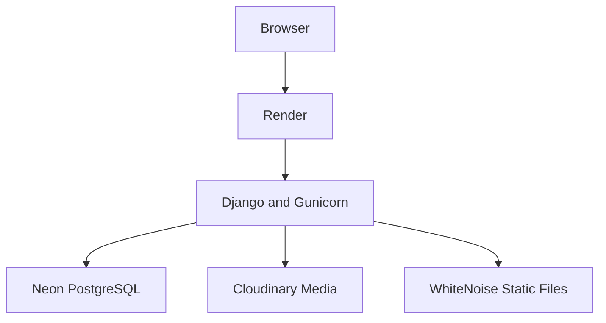

# Bartender Base

[](https://www.python.org/)
[](https://www.djangoproject.com/)
[](https://www.postgresql.org/)
[](https://tailwindcss.com/)

**Bartender Base** is a full-stack learning platform and reference catalog for aspiring bartenders. It combines structured learning paths, practical lessons, cocktail recipes, ingredient and equipment references, personalized progress tracking, and a recipe matcher that answers a practical question: **“What can I make with the ingredients I have?”**

The interface and educational content are currently written in Brazilian Portuguese.

## Live Demo

https://bartender-base.onrender.com/

> When using Render's free tier, the first request after a period of inactivity may take approximately one minute while the service wakes up.

## Table of Contents

- [Project Goals](#project-goals)
- [Key Features](#key-features)
- [How the Cocktail Matcher Works](#how-the-cocktail-matcher-works)
- [Learning Experience](#learning-experience)
- [Authentication and Personalization](#authentication-and-personalization)
- [Technology Stack](#technology-stack)
- [Architecture](#architecture)
- [Data Model](#data-model)
- [Project Structure](#project-structure)
- [Getting Started](#getting-started)
- [Environment Variables](#environment-variables)
- [Database Setup](#database-setup)
- [Seed Data](#seed-data)
- [Running the Application](#running-the-application)
- [Code Quality](#code-quality)
- [Tests and Coverage](#tests-and-coverage)
- [Production and Deployment](#production-and-deployment)
- [Security Notes](#security-notes)
- [Roadmap](#roadmap)
- [Author](#author)

## Project Goals

Bartender Base was created to go beyond a conventional CRUD portfolio project. Its main goals are to:

- organize essential bartending knowledge into a clear learning sequence;
- connect theory to real cocktail recipes, ingredients, techniques, and equipment;
- help beginners understand what they can prepare with the ingredients available to them;
- provide authenticated users with persistent favorites and learning progress;
- demonstrate practical Django development with relational modeling, ORM queries, authentication, testing, responsive templates, and production deployment.

## Key Features

### Cocktail catalog

- Published cocktail listing with pagination;
- Search by cocktail name, description, or ingredient;
- Filters by difficulty, preparation technique, and alcoholic/non-alcoholic type;
- Detailed recipes with preparation time, glassware, garnish, instructions, and difficulty;
- Ordered ingredient quantities and measurement units;
- Optional and required ingredient support;
- Links between cocktails, ingredients, techniques, equipment, and lessons;
- Favorite and unfavorite actions for authenticated users.

### Reference catalog

- Ingredient categories and individual ingredient pages;
- Technique listing and detailed preparation instructions;
- Equipment listing and detail pages;
- Related cocktails displayed on ingredient, technique, and equipment pages;
- Friendly slug-based URLs.

### “What Can I Make?” matcher

- Multi-select ingredient form using a GET request;
- Shareable URLs containing the selected ingredient IDs;
- Exact matches for cocktails that can be prepared immediately;
- A separate section for recipes missing exactly one required ingredient;
- Suggestions that use at least one selected ingredient but are missing multiple ingredients;
- Missing ingredient names and links displayed for every suggestion;
- Optional ingredients excluded from the required-match calculation;
- Unpublished cocktails excluded from all results.

### Learning module

- Published learning path catalog;
- Ordered lessons grouped by learning path;
- Lesson difficulty and estimated reading time;
- Previous and next lesson navigation;
- Related cocktails, ingredients, techniques, and equipment;
- Completion toggles for authenticated users;
- Progress percentage calculated independently for each user;
- Recommendation of the next incomplete lesson.

### Accounts

- User registration;
- Login and POST-based logout;
- Profile dashboard;
- Username and email editing;
- Duplicate email validation;
- Password change;
- Password reset flow;
- Favorite cocktail overview;
- Completed lesson history;
- Learning path progress and next-lesson recommendations.

### User interface

- Server-rendered Django templates;
- Responsive Tailwind CSS design;
- Desktop and mobile navigation;
- Accessible mobile menu state with `aria-expanded` and `aria-controls`;
- Keyboard support, including closing the mobile menu with `Escape`;
- Custom flash messages;
- Custom 404 page;
- Image fallbacks for catalog items without uploaded media.

### Administration

- Django Admin configuration for catalog and learning content;
- Inline cocktail ingredient editing;
- Publishing controls;
- Search, filters, ordering, and prepopulated slugs;
- Favorite and lesson-progress administration.

## How the Cocktail Matcher Works

The matcher is implemented as a Django view backed by ORM queries and in-memory set comparisons:

1. The visitor selects one or more available ingredients.
2. The selected IDs are validated against existing `Ingredient` records.
3. Published cocktails and their required `CocktailIngredient` entries are loaded efficiently.
4. Optional ingredients are removed from the requirements.
5. Required ingredient IDs are compared with the selected ID set.
6. Each cocktail is placed into one of three result groups:
   - ready to prepare;
   - missing one ingredient;
   - missing multiple ingredients, but sharing at least one selected ingredient.

The form uses a GET request, so a selection can be bookmarked or shared:

```text
/cocktails/what-can-i-make/?ingredients=1&ingredients=4&ingredients=8#results
```

## Learning Experience

The included seed script provides seven starter learning paths:

1. Bartending Fundamentals;
2. Organization and Mise en Place;
3. Hygiene and Safety;
4. Customer Service;
5. Preparation Techniques;
6. Spirits and Ingredients;
7. Bar Operations and Control.

Lessons are connected directly to relevant catalog records. A lesson about shaking, for example, can link to the technique page, required equipment, ingredients, and cocktails that use that technique.

## Authentication and Personalization

Bartender Base currently uses Django's built-in `User` model. Personalized records are isolated by user:

- `Favorite` associates a user with a cocktail;
- `LessonProgress` associates a user with a completed lesson;
- database uniqueness constraints prevent duplicate favorites and duplicate completion records;
- modifying favorites or progress requires authentication and a POST request.

## Technology Stack

| Layer | Technology |
| --- | --- |
| Backend | Python 3.14, Django 6.1 |
| Database | PostgreSQL, psycopg 3, dj-database-url |
| Frontend | Django Templates, Tailwind CSS 4, vanilla JavaScript |
| Authentication | Django authentication framework |
| Media | Cloudinary |
| Static files | WhiteNoise |
| Application server | Gunicorn |
| Development process manager | Honcho |
| Hosting | Render |
| Managed PostgreSQL | Neon |
| Testing | Django TestCase, Coverage.py |
| Linting and formatting | Ruff, djLint |

## Architecture



The application uses environment-based database configuration:

- local development reads individual `DB_*` variables;
- production reads a single `DATABASE_URL` connection string;
- uploaded media is stored in Cloudinary;
- compiled CSS, JavaScript, and Django Admin assets are collected and served through WhiteNoise.

## Data Model

### Catalog domain

- `IngredientCategory` groups related ingredients;
- `Ingredient` represents spirits, juices, syrups, fruit, herbs, bitters, and other components;
- `Technique` stores preparation methods and instructions;
- `Equipment` stores bar tools;
- `Glassware` stores serving glass types;
- `Cocktail` stores the recipe, metadata, and publication state;
- `CocktailIngredient` is the explicit many-to-many intermediary that stores quantity, unit, order, notes, and optional status;
- `Favorite` stores each user's saved cocktails.

### Learning domain

- `LearningPath` groups lessons into an ordered curriculum;
- `Lesson` stores educational content and relations to catalog records;
- `LessonProgress` records lesson completion independently for each user.

## Project Structure

```text
bartender-base/
├── accounts/              # Registration, profile and account management
├── cocktails/             # Catalog, recipe matcher and favorites
├── config/                # Django settings and root URL configuration
├── core/                  # Home page
├── learning/              # Learning paths, lessons and progress
├── scripts/
│   └── seed_data.py       # Idempotent initial catalog and learning content
├── static/
│   └── js/                # Mobile navigation behavior
├── templates/             # Shared and app-specific Django templates
├── theme/                 # django-tailwind application
├── build.sh               # Production build commands
├── Procfile.tailwind      # Local Django and Tailwind processes
├── manage.py
├── pyproject.toml         # Ruff and djLint configuration
└── requirements.txt
```

## Getting Started

### Prerequisites

- Python 3.14;
- PostgreSQL;
- Node.js and npm;
- Git.

### 1. Clone the repository

```bash
git clone https://github.com/thierrydrmv/bartender-base.git
cd bartender-base
```

### 2. Create and activate a virtual environment

macOS or Linux:

```bash
python -m venv .venv
source .venv/bin/activate
```

Windows PowerShell:

```powershell
python -m venv .venv
.venv\Scripts\Activate.ps1
```

### 3. Install Python dependencies

```bash
python -m pip install --upgrade pip
pip install -r requirements.txt
```

### 4. Create the environment file

```bash
cp .env.example .env
```

Generate a development secret key:

```bash
python -c "from django.core.management.utils import get_random_secret_key; print(get_random_secret_key())"
```

Copy the generated value into `SECRET_KEY` in `.env`.

### 5. Install Tailwind dependencies

```bash
python manage.py tailwind install
```

## Environment Variables

| Variable | Required | Purpose |
| --- | --- | --- |
| `SECRET_KEY` | Yes | Django cryptographic signing key |
| `DEBUG` | Yes | Enables local debug mode; must be `False` in production |
| `ALLOWED_HOSTS` | Local | Comma-separated local hostnames |
| `DB_NAME` | Local | Local PostgreSQL database name |
| `DB_USER` | Local | Local PostgreSQL role |
| `DB_PASSWORD` | Local | Local PostgreSQL password |
| `DB_HOST` | Local | Local PostgreSQL hostname |
| `DB_PORT` | Local | Local PostgreSQL port |
| `DATABASE_URL` | Production | Complete managed PostgreSQL connection URL |
| `CLOUDINARY_URL` | Production/media | Cloudinary SDK connection URL |
| `EMAIL_HOST_USER` | Email | SMTP account username |
| `EMAIL_HOST_PASSWORD` | Email | SMTP credential or application password |
| `DEFAULT_FROM_EMAIL` | Optional | Default sender shown in outgoing messages |
| `RENDER_EXTERNAL_HOSTNAME` | Render | Automatically provided hostname used by `ALLOWED_HOSTS` and CSRF configuration |

Example local `.env`:

```dotenv
DEBUG=True
SECRET_KEY=replace-with-a-generated-development-key
ALLOWED_HOSTS=localhost,127.0.0.1

DB_NAME=bartender_base
DB_USER=postgres
DB_PASSWORD=replace-with-your-local-password
DB_HOST=localhost
DB_PORT=5432

DATABASE_URL=
CLOUDINARY_URL=

EMAIL_HOST_USER=
EMAIL_HOST_PASSWORD=
DEFAULT_FROM_EMAIL=Bartender Base <noreply@example.com>
```

Never commit `.env`, database exports, provider credentials, or production secrets.

## Database Setup

Create a local PostgreSQL database and ensure that the credentials match the values in `.env`. Then apply the migrations:

```bash
python manage.py migrate
```

Create an administrator account:

```bash
python manage.py createsuperuser
```

The administration interface is available at:

```text
http://127.0.0.1:8000/admin/
```

## Seed Data

Run the seed script through Django's configured shell:

```bash
python manage.py shell < scripts/seed_data.py
```

The script uses `update_or_create()` and explicit relation updates, allowing it to be run again without duplicating the main catalog records. It includes:

- ingredient categories and ingredients;
- techniques, equipment, and glassware;
- ten classic cocktails, including Caipirinha, Mojito, Negroni, Daiquiri, Margarita, Old Fashioned, Gin and Tonic, Moscow Mule, Whiskey Sour, and Aperol Spritz;
- seven learning paths and their starter lessons;
- relations between lessons and relevant catalog content.

## Running the Application

Run Django and the Tailwind watcher together:

```bash
honcho start -f Procfile.tailwind
```

Alternatively, run them in separate terminals:

```bash
python manage.py runserver
```

```bash
python manage.py tailwind start
```

Open [http://127.0.0.1:8000](http://127.0.0.1:8000).

## Code Quality

Run Django's system checks:

```bash
python manage.py check
```

Run Ruff:

```bash
ruff check .
ruff format --check .
```

Run djLint:

```bash
djlint templates --check
```

Apply supported automatic formatting:

```bash
ruff format .
djlint templates --reformat
```

## Tests and Coverage

The repository contains 103 Django tests and currently achieves 98% coverage across the tracked application code.

- catalog models and relationships;
- published and unpublished content behavior;
- search, filtering, and catalog navigation;
- cocktail, ingredient, equipment, and technique detail pages;
- related-content links;
- ingredient matcher classification and edge cases;
- favorites and user data isolation;
- learning path and lesson navigation;
- lesson completion and per-user progress;
- profile recommendations;
- account registration and profile updates;
- duplicate email validation;
- password changes and password reset;
- custom 404 and 500 error pages.

Run the complete test suite:

```bash
python manage.py test
```

Run tests with coverage:

```bash
coverage run manage.py test
coverage report -m
```

Generate the navigable HTML report:

```bash
coverage html
open htmlcov/index.html
```

On Linux, replace the final command with:

```bash
xdg-open htmlcov/index.html
```

## Production and Deployment

The current deployment architecture uses:

- **Render** for the Django web service;
- **Neon** for persistent PostgreSQL data;
- **Cloudinary** for persistent uploaded media;
- **WhiteNoise** for collected static assets;
- **Gunicorn** as the production WSGI server.

The production build script executes:

```bash
pip install -r requirements.txt
python manage.py tailwind install
python manage.py tailwind build
python manage.py collectstatic --noinput
python manage.py migrate
```

Render build command:

```bash
./build.sh
```

Render start command:

```bash
gunicorn config.wsgi:application --bind 0.0.0.0:$PORT
```

Recommended production variables:

```dotenv
DEBUG=False
SECRET_KEY=<generated-production-secret>
DATABASE_URL=<neon-postgresql-url>
CLOUDINARY_URL=<cloudinary-url>
PYTHON_VERSION=3.14.7
```


Render automatically provides the `RENDER_EXTERNAL_HOSTNAME` environment variable.

## Security

Sensitive configuration is managed through environment variables, including the Django secret key, database credentials, Cloudinary configuration, and email credentials.

Production security settings include:

- Secure session and CSRF cookies;
- HTTPS proxy header support;
- Disabled debug mode;
- Authentication requirements for favorites and lesson progress;
- POST-only requests for state-changing actions;
- Database constraints to prevent duplicate favorites and lesson progress records.

Environment files, credentials, logs, local media, collected static files, virtual environments, caches, and coverage reports are excluded from version control.

Run the following checks before deployment:

```bash
python manage.py check --deploy
ruff check .
djlint templates --check
python manage.py test
```

## Roadmap

- Expand the cocktail and learning content;
- Add more images for cocktails, ingredients, glassware, and equipment;
- Add SEO metadata and social sharing previews;
- Introduce continuous integration for automated tests;
- Add social authentication and profile customization;
- Support a custom domain.


## Author

Developed by [Thierry Varela](https://github.com/thierrydrmv).

If you find this project useful, consider starring the repository.
